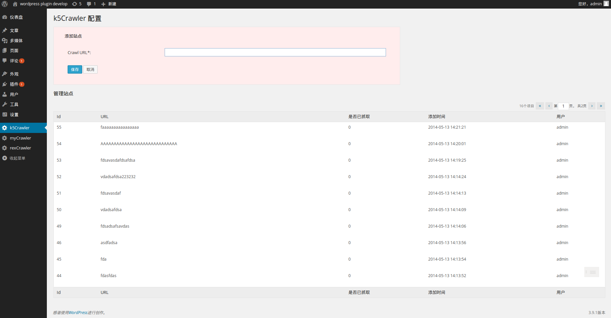

k5Crawler for Wordpress 3.8+
=====

source code
[https://github.com/phpgcs/k5Crawler](https://github.com/phpgcs/k5Crawler)

used by
[http://5kan.me](http://5kan.me)

ScreenShot
=====

V1.0
======

+ site urls manage include add/upt/del
+ auto database table create
+ items pagination
+ items authority mechanism
+ page style in accordance with WP3.8+

roadMap
=====

+ crawle artiles and save data into wp-posts
